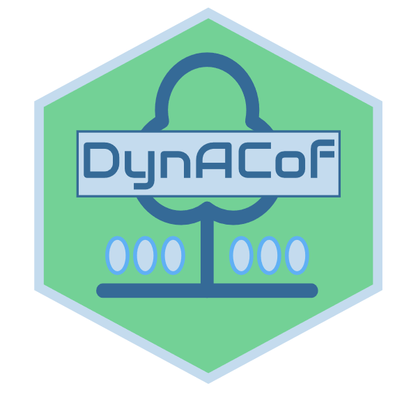

---
output:
  github_document:
   html_preview: false
---

  <!-- README.md is generated from README.Rmd. Please edit that file -->

```{r setup, echo = FALSE}
knitr::opts_chunk$set(
  collapse = TRUE,
  comment = "#>",
  fig.path = "man/figures/README-"
)
options(tibble.print_min = 5, tibble.print_max = 5)
```
  

# DynACof: The Dynamic Agroforestry Coffee Crop Model 
<!--  -->
<!-- [](https://travis-ci.org/VEZY/DynACof)   -->
[](http://www.repostatus.org/#wip)
[](https://travis-ci.com/VEZY/DynACof)
[](https://gitter.im/DynACof/Lobby?utm_source=badge&utm_medium=badge&utm_campaign=pr-badge&utm_content=badge) 
[](https://www.gnu.org/licenses/gpl-3.0)

## Overview

The DynACof process-based model computes plot-scale Net Primary Productivity, carbon allocation, growth, yield,
energy, and water balance of coffee plantations according to management, while accounting for spatial effects using
metamodels from the 3D process-based MAESPA. The model also uses coffee bud and fruit cohorts for reproductive
development to better represent fruit carbon demand distribution along the year.

## Installation

The development version from [GitHub](https://github.com/) can be installed with:

``` r
# install.packages("devtools")
devtools::install_github("VEZY/DynACof")
```

Or using the lightweight [remotes](https://github.com/r-lib/remotes#readme) package: 

``` r
# install.packages("remotes")
remotes::install_github("VEZY/DynACof")
```

For the moment, there is no [CRAN](https://CRAN.R-project.org) released version of DynACof, but we work on that.
You will soon be able to run this command to install the package:

``` r
install.packages("DynACof")
```

## Example

This is a basic example using all defaults (parameters and meteorology) over 2 years :

```{r example1, eval=FALSE}
rm(list = ls())
library("DynACof")
Sys.setenv(TZ="UTC")
DynACof(Period= as.POSIXct(c("1979-01-01", "1980-12-31")))
```

To use your own data, you'll have to tell DynACof where to find it using `Inpath` parameter, and what is the 
files names with the `FileName` parameter list:  
```{r example2, eval=FALSE}
rm(list = ls())
library("DynACof")
Sys.setenv(TZ="UTC")
DynACof(WriteIt = T, Period= as.POSIXct(c("1979-01-01", "1980-12-31")),Inpath = "1-Input/Aquiares/",
                    Simulation_Name = "Test1",
                    FileName = list(Site = "1-Site.R", Meteo ="2-Meteorology.txt", Soil = "3-Soil.R",
                                    Coffee = "4-Coffee.R", Tree = NULL))
```
  
Note that the Meteo file can be of any regular format because the 
model uses the `data.table::fread` function internally.

Enjoy !!

## Acknowledgments

The DynACof model was mainly developed thanks to the MACCAC project^[**MACACC project ANR-13-AGRO-0005**,
Viabilité et Adaptation des Ecosystèmes Productifs, Territoires et Ressources face aux Changements Globaux 
AGROBIOSPHERE 2013 program], which was funded by the french ANR (Agence Nationale de la Recherche). The authors were funded by 
CIRAD^[Centre de Coopération Internationale en Recherche Agronomique pour le Développement] and INRA^[Institut National de la Recherche Agronomique]. The authors are grateful for the support of CATIE^[Centro Agronómico Tropical de Investigación y Enseñanza] for the long-term coffee agroforestry trial, the SOERE F-ORE-T which is supported annually by Ecofor, Allenvi and the French national research infrastructure [ANAEE-F](http://www.anaee-france.fr/fr/); the CIRAD-IRD-SAFSE project (France) and the PCP platform of CATIE. CoffeeFlux observatory was supported and managed by CIRAD researchers. We are grateful to the staff from Costa-Rica, in particular Alvaro Barquero, Alejandra Barquero, Jenny Barquero, Alexis Perez, Guillermo Ramirez, Rafael Acuna, Manuel Jara, Alonso Barquero for their technical and field support.

---

<sub>The DynACof logo was made using <a href="http://logomakr.com" title="Logo Makr">LogoMakr.com</a> </sub>  
```{r logo, eval=FALSE, echo=FALSE}
# See: https://logomakr.com/2GmRlK
# knit("README.Rmd")
```

